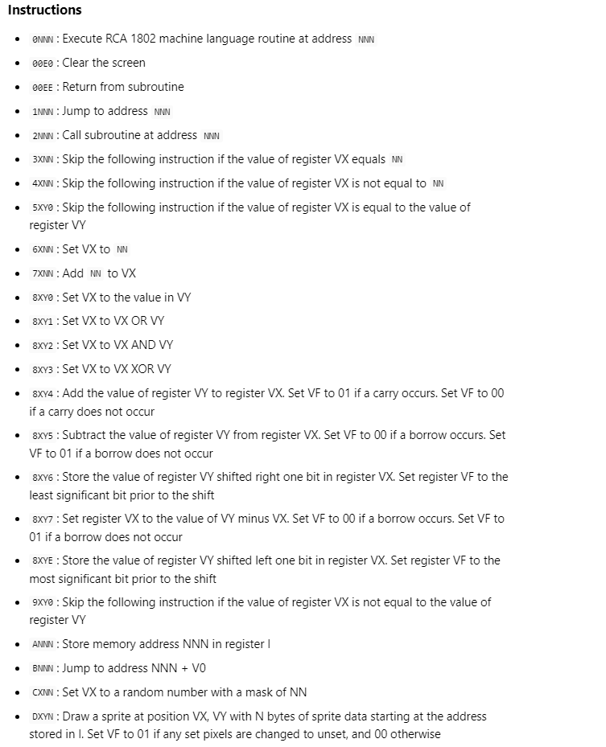

# Chip 8 Emulator

I wanted to learn about low-level programming while practicing my C++ skills, so I started researching online. I discovered that many people recommend starting with a Chip-8 emulator for those interested in building emulators. Its not that im into emulators that much but i saw this more as some sort off challenge 

## Lessons Learned

What did i learn while building this project? 
Well to be honest this project was one of the hardest projects i ever worked on so i learned alot but if i had one thing i would say learning about opcodes and how to decode and execute them was something that will stay in my mind for sure. 

## Screenshots
I just put this here since this is what helped me 

)

## Acknowledgements

 - [This Helped me](https://multigesture.net/articles/how-to-write-an-emulator-chip-8-interpreter/)
 - [This Helped me aswell](http://www.codeslinger.co.uk/pages/projects/chip8.html)
 - [This Also helped](https://github.com/sarbajitsaha/Chip-8-Emulator/blob/master/src/chip8.cpp)
 - [This Did Help Aswell](https://austinmorlan.com/posts/chip8_emulator/)
 - [Also usefull](https://chip-8.github.io/extensions/)

## Todo

- Inputs 
- Audio
- Swap between games
- Refactor DecodeAndExecute function

